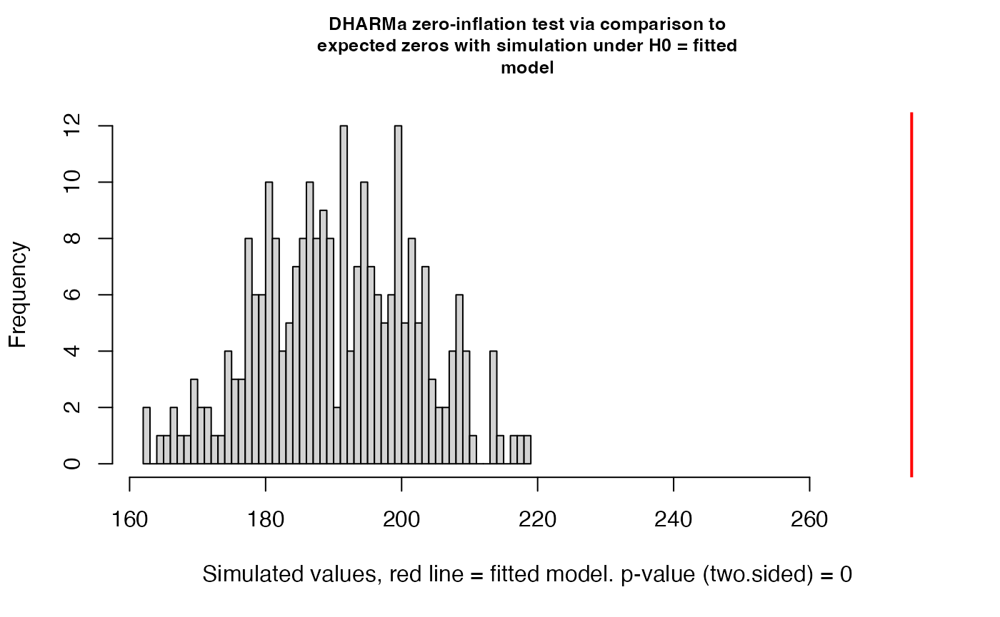
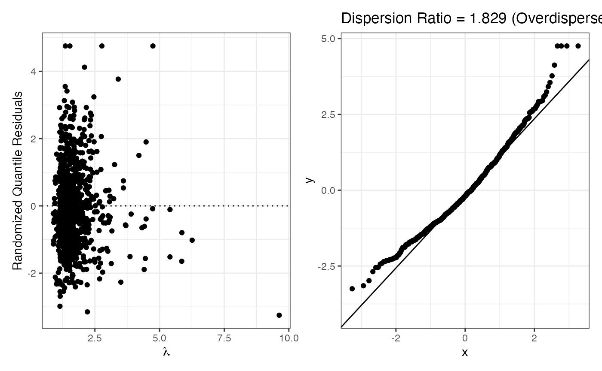

# tutorial

``` r
library(smartcount)
```

## Introduction

The `smartcount` package provides a streamlined workflow for count
regression analysis.

## Dataset

We use `bioChemists` dataset from the `pscl` package, which records the
number of articles published by 915 PhD biochemists.

``` r
library(pscl)
#> Classes and Methods for R originally developed in the
#> Political Science Computational Laboratory
#> Department of Political Science
#> Stanford University (2002-2015),
#> by and under the direction of Simon Jackman.
#> hurdle and zeroinfl functions by Achim Zeileis.
data("bioChemists")
head(bioChemists)
#>   art   fem     mar kid5  phd ment
#> 1   0   Men Married    0 2.52    7
#> 2   0 Women  Single    0 2.05    6
#> 3   0 Women  Single    0 3.75    6
#> 4   0   Men Married    1 1.18    3
#> 5   0 Women  Single    0 3.75   26
#> 6   0 Women Married    2 3.59    2
```

## Summarize Data

### Before fitting model, we examine whether the data user provides is a data frame and whether the response variable exists

``` r
summarize_count_data(bioChemists, "art")
#> $n
#> [1] 915
#> 
#> $mean
#> [1] 1.692896
#> 
#> $variance
#> [1] 3.709742
#> 
#> $min
#> [1] 0
#> 
#> $max
#> [1] 19
#> 
#> $n_zeros
#> [1] 275
#> 
#> $pct_zeros
#> [1] 30.05464
#> 
#> $var_mean_ratio
#> [1] 2.191358
```

## Fit a Poisson Model

### We start with a Poisson regression

``` r
fit_p <- fit_count(bioChemists, art~ fem + mar + kid5 + phd + ment, 
              model="poisson")
```

## Check Conditions

``` r
check_conditions(fit_p)
```



    #> $plot



    #> 
    #> $pearson_ratio
    #> [1] 1.828984
    #> 
    #> $dispersion_diagnosis
    #> [1] "Overdispersion detected. Consider Negative Binomial or Quasi-Poisson."
    #> 
    #> $zero_inflation_pvalue
    #> [1] 0
    #> 
    #> $suggestion
    #> [1] "Zero Inflation and Overdispersion Problem. Consider Zero-inflated Negative Binomial!"
    #> 
    #> $vif
    #>      fem      mar     kid5      phd     ment 
    #> 1.108477 1.264643 1.286110 1.067307 1.081109 
    #> 
    #> $sample_size
    #> $sample_size$total_events
    #> [1] 1549
    #> 
    #> $sample_size$n_predictors
    #> [1] 6
    #> 
    #> $sample_size$threshold
    #> [1] 60
    #> 
    #> $sample_size$is_sufficient
    #> [1] TRUE

## Try fit ZIP based on suggestions

The Poisson check above suggested that the data may have overdispersion
and/or zero inflation. We try a Zero-Inflated Poisson (ZIP) model to
better handle the excess zeros.

``` r
fit_zip <- fit_count(bioChemists, art ~ fem + mar + kid5 + phd + ment, 
                     model = "zip")
check_conditions(fit_zip)
#> $dispersion_ratio
#> [1] 1.533498
#> 
#> $suggestion
#> [1] "Extra overdispersion detected. Consider ZINB."
```

## Evaluate and Compare Models

We use [`evaluate_model()`](../reference/evaluate_model.md) to look at
fit statistics. AIC and BIC measure relative fit quality (lower is
better).

``` r
evaluate_model(fit_p)$stats
#> $AIC
#> [1] 3314.113
#> 
#> $BIC
#> [1] 3343.026
#> 
#> $logLik
#> [1] -1651.056
#> 
#> $mcfadden_r2
#> [1] 0.05251839
#> 
#> $mcfadden_interpretation
#> [1] "Weak"
#> 
#> $deviance_r2
#> [1] 0.1007119
#> 
#> $deviance_interpretation
#> [1] "Moderate"
evaluate_model(fit_zip)$stats
#> $AIC
#> [1] 3233.546
#> 
#> $BIC
#> [1] 3291.373
#> 
#> $logLik
#> [1] -1604.773
#> 
#> $mcfadden_r2
#> [1] NA
#> 
#> $mcfadden_interpretation
#> [1] "Not available for zero-inflated models"
#> 
#> $deviance_r2
#> [1] NA
#> 
#> $deviance_interpretation
#> [1] "Not available for zero-inflated models"
```

To compare the two models directly, we pass both into
[`evaluate_model()`](../reference/evaluate_model.md). Since one model is
zero-inflated and the other is not, the function automatically uses the
**Vuong test** for non-nested comparison.

``` r
comparison <- evaluate_model(fit_p, fit_zip)
#> Vuong Non-Nested Hypothesis Test-Statistic: 
#> (test-statistic is asymptotically distributed N(0,1) under the
#>  null that the models are indistinguishible)
#> -------------------------------------------------------------
#>               Vuong z-statistic             H_A    p-value
#> Raw                   -4.180493 model2 > model1 1.4544e-05
#> AIC-corrected         -3.638551 model2 > model1 0.00013709
#> BIC-corrected         -2.332762 model2 > model1 0.00983032
comparison$comparison
#> NULL
```

A negative Vuong z-statistic indicates that the second model (ZIP) is
preferred over the first (Poisson).

## Interpret Final Model

We use [`interpret()`](../reference/interpret.md) to translate the ZIP
coefficients into clear, non-technical language. The output table
includes:

- `estimated_log`: coefficient on the log scale
- `estimated_exp`: exponentiated coefficient (rate ratio or odds ratio)
- `percentage`: percent change in expected count
- `ci_lower_pct` / `ci_upper_pct`: 95% confidence interval (percent
  scale)
- `z_value` / `p_value`: hypothesis test statistics
- `interpretation`: plain-English interpretation

``` r
result <- interpret(fit_zip)
#> This model has an offset. Coefficients describe rates per unit of the offset variable.
result[, c("variable", "percentage", "ci_lower_pct", "ci_upper_pct", "p_value")]
#>             variable percentage ci_lower_pct ci_upper_pct p_value
#> 1  count_(Intercept)     89.807       49.643      140.752  0.0000
#> 2     count_femWomen    -18.872      -28.353       -8.137  0.0010
#> 3   count_marMarried     10.932       -3.500       27.523  0.1446
#> 4         count_kid5    -13.352      -21.044       -4.911  0.0025
#> 5          count_phd     -0.615       -6.475        5.613  0.8424
#> 6         count_ment      1.826        1.369        2.285  0.0000
#> 7   zero_(Intercept)    -43.845      -79.308       52.397  0.2573
#> 8      zero_femWomen     11.599      -35.545       93.227  0.6952
#> 9    zero_marMarried    -29.813      -62.338       30.799  0.2650
#> 10         zero_kid5     24.247      -15.465       82.612  0.2692
#> 11          zero_phd      0.128      -24.681       33.107  0.9930
#> 12         zero_ment    -12.551      -19.972       -4.442  0.0030
```

The full interpretation column:

``` r
result$interpretation
#>  [1] "The expected count is 1.898 for observations that are not structural zeros, when all continuous predictors are zero and all categorical predictors are at their reference level."
#>  [2] "For femWomen , the expected count changes by -18.872 % (95% CI: -28.353 % to -8.137 %), adjusting for simultaneous linear change in other count-part predictors."                
#>  [3] "For marMarried , the expected count changes by 10.932 % (95% CI: -3.5 % to 27.523 %), adjusting for simultaneous linear change in other count-part predictors."                  
#>  [4] "For kid5 , the expected count changes by -13.352 % (95% CI: -21.044 % to -4.911 %), adjusting for simultaneous linear change in other count-part predictors."                    
#>  [5] "For phd , the expected count changes by -0.615 % (95% CI: -6.475 % to 5.613 %), adjusting for simultaneous linear change in other count-part predictors."                        
#>  [6] "For ment , the expected count changes by 1.826 % (95% CI: 1.369 % to 2.285 %), adjusting for simultaneous linear change in other count-part predictors."                         
#>  [7] "The log odds of being a structural zero is -0.577 when all continuous predictors are zero and all categorical predictors are at their reference level."                          
#>  [8] "For femWomen , the log odds of being a structural zero changes by 0.11 (odds ratio: 1.116 ), adjusting for simultaneous linear change in other zero-part predictors."            
#>  [9] "For marMarried , the log odds of being a structural zero changes by -0.354 (odds ratio: 0.702 ), adjusting for simultaneous linear change in other zero-part predictors."        
#> [10] "For kid5 , the log odds of being a structural zero changes by 0.217 (odds ratio: 1.242 ), adjusting for simultaneous linear change in other zero-part predictors."               
#> [11] "For phd , the log odds of being a structural zero changes by 0.001 (odds ratio: 1.001 ), adjusting for simultaneous linear change in other zero-part predictors."                
#> [12] "For ment , the log odds of being a structural zero changes by -0.134 (odds ratio: 0.874 ), adjusting for simultaneous linear change in other zero-part predictors."
```

ZIP coefficients are split into two parts:

- `count_xxx`: how the predictor affects the expected count among
  non-structural-zero observations
- `zero_xxx`: how the predictor affects the log-odds of being a
  structural zero (i.e., someone who never publishes)

## Extension: Generalized Poisson with Real Data

Beyond the standard count regression models, `smartcount` also supports
Generalized Poisson regression, which is more flexible than Poisson when
the data exhibit overdispersion (or, less commonly, underdispersion).

To demonstrate, we replicate the analysis from Akter et al. (2025),
*“Accounting for overdispersion in skilled antenatal care: Identifying
determinants using Bangladesh Demographic and Health Survey 2022 data”*
(PLOS ONE). The authors use a Generalized Poisson model to study factors
influencing the number of skilled antenatal care visits among 3,839
Bangladeshi women.

``` r
df <- read.csv("../data-raw/bangladesh_anc.csv")

fit_gp <- fit_count(
  df,
  ANC_skilled ~ Mothers_Edu + Wealth_index + Media_Exposed,
  model = "genpois"
)
#> Warning in check_dep_version(dep_pkg = "TMB"): package version mismatch: 
#> glmmTMB was built with TMB package version 1.9.19
#> Current TMB package version is 1.9.21
#> Please re-install glmmTMB from source or restore original 'TMB' package (see '?reinstalling' for more information)

check_conditions(fit_gp)
#> $pearson_ratio
#> [1] 1.003438
#> 
#> $diagnosis
#> [1] "Pearson ratio close to 1 — Generalized Poisson appears to handle the dispersion well."
#> 
#> $sample_size
#> $sample_size$total_events
#> [1] 11737
#> 
#> $sample_size$n_predictors
#> [1] 4
#> 
#> $sample_size$threshold
#> [1] 40
#> 
#> $sample_size$is_sufficient
#> [1] TRUE
```

The Pearson dispersion ratio close to 1 confirms that the Generalized
Poisson model handles the overdispersion well.

``` r
interpret(fit_gp)
#>        variable estimated_log estimated_exp percentage ci_lower_pct
#> 1   (Intercept)         0.241         1.273     27.315       18.564
#> 2   Mothers_Edu         0.272         1.313     31.278       27.227
#> 3  Wealth_index         0.158         1.171     17.073       13.462
#> 4 Media_Exposed         0.245         1.277     27.714       21.733
#>   ci_upper_pct z_value p_value
#> 1       36.712   6.647       0
#> 2       35.458  17.018       0
#> 3       20.800   9.860       0
#> 4       33.989   9.997       0
#>                                                                                                          interpretation
#> 1                                                       The expected count is 1.273 when all other predictors are zero.
#> 2   For every one-unit increase in Mothers_Edu , the expected count changes by 31.278 % (95% CI: 27.227 % to 35.458 %).
#> 3    For every one-unit increase in Wealth_index , the expected count changes by 17.073 % (95% CI: 13.462 % to 20.8 %).
#> 4 For every one-unit increase in Media_Exposed , the expected count changes by 27.714 % (95% CI: 21.733 % to 33.989 %).
```

``` r
evaluate_model(fit_gp)$stats
#> $AIC
#> [1] 15837.4
#> 
#> $BIC
#> [1] 15868.66
#> 
#> $logLik
#> [1] -7913.7
#> 
#> $mcfadden_r2
#> [1] NA
#> 
#> $mcfadden_interpretation
#> [1] "Not available for glmmTMB models"
#> 
#> $deviance_r2
#> [1] NA
#> 
#> $deviance_interpretation
#> [1] "Not available for glmmTMB models"
```

## Conclusion

The `smartcount` package provides an end-to-end workflow for count
regression analysis:

1.  **Summarize** the data to understand its structure
2.  **Fit** a starting Poisson model
3.  **Check** the model’s conditions
4.  **Switch** to a more appropriate model if needed (Quasi-Poisson,
    Negative Binomial, ZIP, ZINB, or Generalized Poisson)
5.  **Evaluate** model fit and compare alternatives
6.  **Interpret** results in plain language

This integrated workflow saves users from manually stitching together
functions from different packages and applies appropriate diagnostic and
interpretation logic for each model type.

## References

- Akter et al. (2025). Accounting for overdispersion in skilled
  antenatal care: Identifying determinants using Bangladesh Demographic
  and Health Survey 2022 data. *PLOS ONE*.
  <https://doi.org/10.1371/journal.pone.0346258>

- Long, J. S. (1990). The origins of sex differences in science. *Social
  Forces*, 68(4), 1297-1316. (`bioChemists` dataset)
